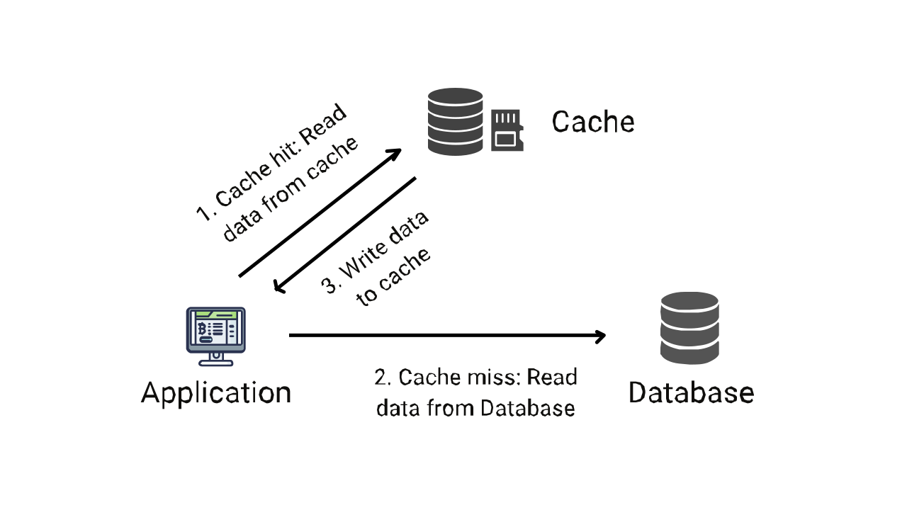
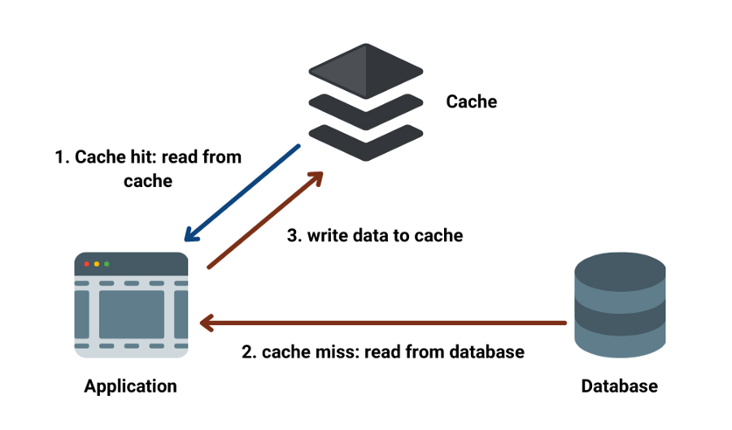

# Caching: System Design Concept



In this blog, we will learn about Caching, an important fundamental concept in system design. Have you ever experienced that when you open a website the first time, it takes more time than usual, but when you open the same website again, it takes no time to load? Do you know why this happens? Let’s find out!

## What do you mean by caching?

Caching is the process of storing the results of a request at a different location than the original or a temporary storage location so that we can avoid redoing the same operations. Basically, the cache is temporary storage for files and data such that it’s faster to access this data from this new location.



### Caching Examples

- Web Browsers cache the HTML, CSS, JS, and images for faster access to the website when requested again.
- CDNs store static files and help reduce latency.
- DNS is used to get the IP address of a query. So, rather than requesting the IP address multiple times, it can be stored in a cache, allowing us not to re-perform a DNS query again, and the web pages can be accessed more quickly.

## Real-World Analogy of Caching

Let us take an example of a librarian to understand the basic idea behind the cache system. Let's imagine a library with 1000s of books and a librarian behind the desk whose responsibility is to get you the desired book from the library store. First, let’s start with a librarian without a cache.

The day starts, and the first customer arrives. He asks for a book; let’s say Book A. The librarian goes to the storeroom, fetches the book, returns it to the desk, and issues the book to the customer. After some days, the customer returns the book, and the librarian keeps the book back to its place and returns to her desk to wait for another customer.


Now, the next customer arrives, and he asks for the same Book A. The librarian again has to go to the same place and fetch the book and give it to the customer. In this system, the librarian has to visit the store every time a customer arrives — even to get the book that is demanded frequently.

## Implementation of a simple Cache using Node.js

Let’s implement a simple caching system:

First, we will create a simple server and a database. We will use the database to get the HTML page and the server to host the page locally. We will create two end-points, one that uses the cache and the other that does not.

```js
const express = require('express);

const app = express();

// define cache
const cache = {};

const database = {
    // we will be using this database to get this html page
    ['index.html']: '<html>Node.js Implementation of Caching!</html>',
};

get Database = (key, callback) => {
    
}
```

If we look in the browser on the server with the endpoint having no-cache, it will take 3 seconds to load (since we used setTimeout to load the page with no cache in 3 seconds). If you refresh this page again, it will again take 3 seconds to load the page because every time we refresh the page, it goes to the database to fetch it. Now, in the end-point, which uses caching, the first time we go to the endpoint with cache, it takes 3 seconds to load the page since the cache is empty and has to go to the database to fetch the data. But, when we refresh the page, it loads instantly. As soon as we loaded the page the first time, we cached the results for future requests.

### Cache Eviction policy

We need to delete existing items for new resources when the cache is complete. In fact, it is just one of the most popular methods to delete the least recently used object. The solution is to optimize the probability in the cache that the requesting resource exists

**Random Replacement (RR)**: As the term suggests, we can randomly delete an entry.

**Least frequently used (LFU)**: We can keep a count of how frequently an item is requested and delete the least frequently used.

**Least Recently Used (LRU)**: In LRU, we delete the item that has been used least recently.

**First In First Out (FIFO)**: The FIFO algorithm holds an object queue in the order that the objects have been loaded into the cache. It evicts one or more objects from the head when a cache misses and inserts a new object into the queue tail. Upon a cache hit, the list does not shift.

## What are the different types of caching?

### Application server cache

We can cache the data directly in the Application Layer. Every time a request is made to the service, it will return local, cached data quickly if it exists. If it is not in the cache, it will query the data from the database.

### Global caches

In Global Caches, the same single cache space is used for all the nodes. Each of the application nodes queries the cache in the same way as a local one would be.

### Distributed cache

The cache is usually broken up using a consistent hashing algorithm, and each of its nodes owns part of the cached data. If a requesting node is searching for a certain piece
of data, it can easily use the hashing function to locate information from the distributed cache to decide if the data is available.

### Content Distribution Network (CDN)
