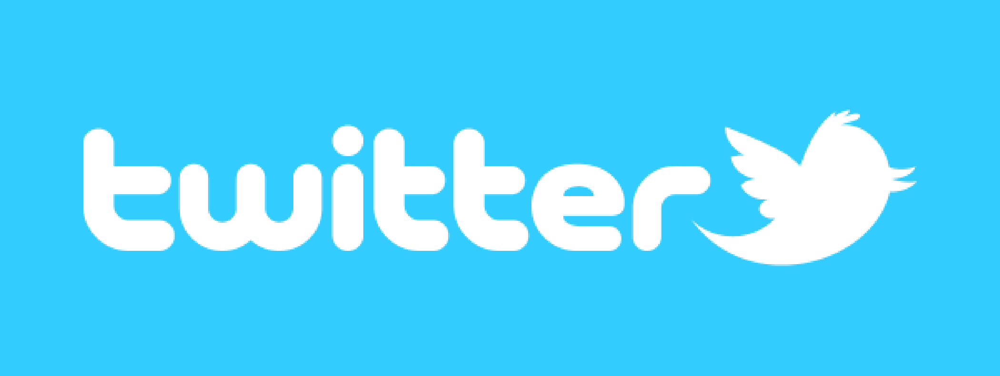

# System Design Twitter

Let's design a Twitter-like social networking service. Users of the service will be able to post tweets, follow other people, and favorite tweets.

- Difficulty Level: Medium

## 1. What is Twitter?

Twitter is an online social networking service where users post and read short 140-character messages called "tweets." Registered users can post and read tweets, but those who are not registered can only read them. Users access Twitter through their website interface, SMS, or mobile app.

## 2. Requirements and Goals of the System

We will be designing a simpler version of Twitter with the following requirements:

## Functional Requirements

1. Users should be able to post new tweets.
2. A user should be able to follow other users.
3. Users should be able to mark tweets as favorites.
4. The service should be able to create and display a user’s timeline consisting of top tweets from all the people the user follows.
5. Tweets can contain photos and videos.

## Non-functional Requirements

1. Our service needs to be highly available.
2. Acceptable latency of the system is 200ms for timeline generation.
3. Consistency can take a hit (in the interest of availability); if a user doesn’t see a tweet for a while, it should be fine.

## Extended Requirements

1. Searching for tweets.
2. Replying to a tweet.
3. Trending topics – current hot topics/searches.
4. Tagging other users.
5. Tweet Notification.
6. Who to follow? Suggestions?
7. Moments.

## 3. Capacity Estimation and Constraints

